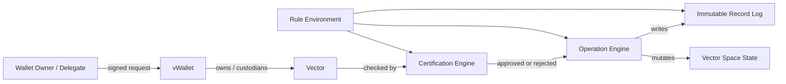
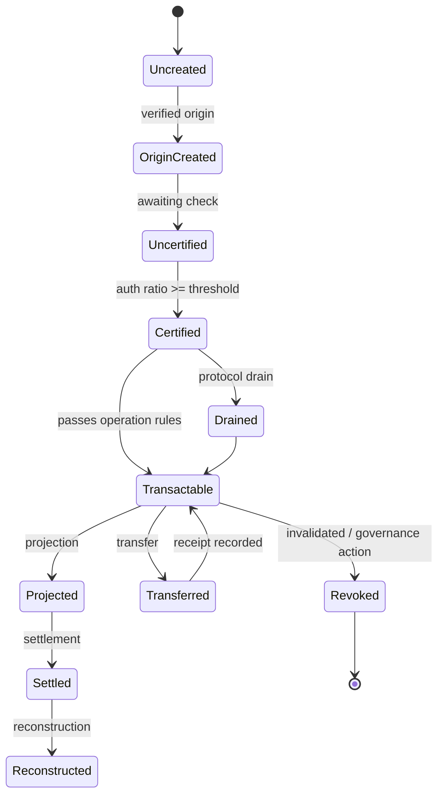
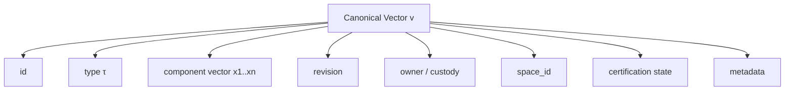
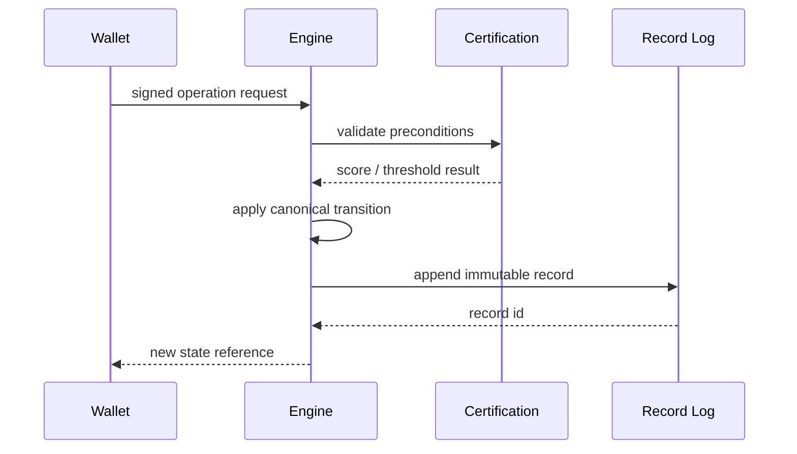

# Canonical Vector State Model

**Document status:** Normative specification  
**Applies to:** Vector values, wallet ownership bindings, certifications, projections, reconstructions, drains, records, and cross-space state transitions.

---

## 1. Purpose

This document defines the canonical vector state model for Vector Network. It specifies the exact abstract state, the mathematical representation of vectors, the transition semantics, the required invariants, the canonical serialization constraints, and the record structure used to prove and replay state change.

This document is normative. Any implementation claiming compatibility with Vector Network MUST preserve the meanings defined here.

---

## 2. Normative language

- **MUST**: absolute requirement.
- **MUST NOT**: absolute prohibition.
- **SHOULD**: recommended behavior, with valid exceptions possible.
- **MAY**: permitted behavior.

---

## 3. Canonical state overview

The canonical network state is represented as a tuple:

\[
\mathcal{S} = \langle \mathcal{W}, \mathcal{V}, \mathcal{R}, \mathcal{C}, \mathcal{P}, \mathcal{X} \rangle
\]

where:

- \(\mathcal{W}\) is the set of wallets.
- \(\mathcal{V}\) is the set of vector instances.
- \(\mathcal{R}\) is the append-only record log.
- \(\mathcal{C}\) is the certification relation and its cached outcomes.
- \(\mathcal{P}\) is the set of active projections.
- \(\mathcal{X}\) is the protocol rule environment, including type definitions, parameter schedules, and governance state.

The state is canonical when every valid implementation can derive the same abstract meaning from the same record stream and protocol parameters.

---

## 4. Canonical objects

### 4.1 Wallet

A wallet is identified by a public key or equivalent public identifier.

A canonical wallet is modeled as:

\[
w = \langle id, pk, meta, holdings, status \rangle
\]

where:

- \(id\) is a stable wallet identifier.
- \(pk\) is the public key or public credential.
- \(meta\) is wallet metadata.
- \(holdings\) is a mapping from vector identifiers to custody relations.
- \(status\) is a wallet status flag such as active, frozen, revoked, or archived.

A private key MUST NOT appear in canonical shared state.

### 4.2 Vector

A vector is the fundamental state object. For type \(\tau\) with dimension \(n\), a canonical vector is modeled as:

\[
v = \langle id, \tau, \mathbf{x}, rev, owner, space, cert, meta \rangle
\]

where:

- \(id\) is the vector identifier.
- \(\tau\) is the vector type identifier.
- \(\mathbf{x} = (x_1, x_2, \dots, x_n)\) is the component vector.
- \(rev\) is the revision number.
- \(owner\) is the owning wallet identifier, or a protocol-visible custody relation.
- \(space\) is the identifier of the current vector space.
- \(cert\) is the certification state.
- \(meta\) is type-aware metadata.

A vector instance is not defined solely by its coordinates; it is defined by the complete tuple above.

### 4.3 Record

A record is the immutable proof-bearing description of a state transition.

\[
r = \langle rid, v_{before}, v_{after}, op, params, cert, ts, proof, space \rangle
\]

A record MUST be append-only and MUST preserve enough information to replay the transition under the same protocol rules.

### 4.4 Certification cache

Certification results MAY be cached for performance, but the cached value MUST be derivable from the authoritative rule set and proof material.

\[
c = \langle target, op, score, threshold, valid, evidence \rangle
\]

### 4.5 Projection

A projection is a locked or committed sub-state derived from a source vector:

\[
p = \langle pid, source, amount, rule_set, lock_state, settlement \rangle
\]

### 4.6 Rule environment

The rule environment is the set of active definitions that interpret state:

\[
\mathcal{X} = \langle types, thresholds, drains, projection_rules, reconstruction_rules, governance_rules \rangle
\]

---

## 5. Mathematical definitions

### 5.1 Component domain

For each type \(\tau\), the component domain is a type-declared set:

\[
D_\tau = D_{\tau,1} \times D_{\tau,2} \times \dots \times D_{\tau,n}
\]

Unless a type says otherwise, the default component domain is the non-negative real numbers or a protocol-approved fixed-point subset thereof.

A type MAY allow signed values only if signed semantics are explicitly declared.

### 5.2 Magnitude

The default magnitude of a vector is:

\[
M(v) = \sum_{i=1}^{n} x_i
\]

If a type defines weighted magnitude, then:

\[
M_\tau(v) = \sum_{i=1}^{n} \omega_i x_i
\]

where \(\omega_i\) are declared type weights.

### 5.3 Composition / direction

For any vector with \(M(v) > 0\), the normalized composition is:

\[
\hat{d}(v) = \left( \frac{x_1}{M(v)}, \frac{x_2}{M(v)}, \dots, \frac{x_n}{M(v)} \right)
\]

The normalized composition is undefined when \(M(v) = 0\). Implementations MUST guard this case.

### 5.4 Zero vector

The zero vector is:

\[
\mathbf{0} = (0, 0, \dots, 0)
\]

Properties:

- \(M(\mathbf{0}) = 0\)
- \(\hat{d}(\mathbf{0})\) is undefined
- all zero-preserving operations MUST map zero to zero
- zero MUST remain zero under valid drain, transfer, projection, reconstruction, and certification operations unless a type explicitly defines a non-standard neutral element

### 5.5 State transition function

A protocol operation is modeled as a partial transition function:

\[
T_{op}: \mathcal{S} \times Req_{op} \rightharpoonup \mathcal{S}
\]

where \(Req_{op}\) is the operation-specific request set.

A transition is valid only if:

1. the preconditions hold,
2. the authority check succeeds,
3. the certification rule succeeds when required,
4. the type constraints are satisfied,
5. the resulting state is internally consistent,
6. a record is emitted.

### 5.6 Conservation law

For a generic transition, let:

- \(b\) be the before-state magnitude,
- \(a\) be the after-state magnitude,
- \(d\) be the explicit drain,
- \(g\) be authorized gain,
- \(l\) be authorized loss.

Then the canonical accounting identity is:

\[
a = b - d + g - l
\]

This identity MUST hold for any operation class that declares conservation semantics. If an operation class uses a different settlement model, that model MUST be declared explicitly and MUST remain deterministic.

### 5.7 Projection and reconstruction

Let \(v\) be the source vector and \(p\) be the projected portion.

Projection creates a locked sub-state:

\[
v \rightarrow (v_{free}, p_{locked})
\]

where:

\[
M(v) = M(v_{free}) + M(p_{locked})
\]

At settlement time, reconstruction returns the unlocked or settled quantity:

\[
p_{locked} \rightarrow p_{settled}
\]

and the final restored state is:

\[
v' = v_{free} + p_{settled}
\]

where \(+\) denotes type-valid component-wise composition under the vector type rules.

### 5.8 Drain

Drain is an explicit protocol cost. For drain rate \(\delta\) with \(0 \le \delta \le 1\), a drained transfer of magnitude \(M(v)\) produces:

\[
M(v') = (1 - \delta) M(v)
\]

This is the default form. A type MAY define a fixed drain schedule, tiered drain, or cap-based drain, but the schedule MUST be declared before execution and MUST be deterministic.

### 5.9 Certification score

AuthRatio is a normalized composite validity score:

\[
A(v, op) = f(m_{valid}, c_{valid}, o_{valid}, t_{valid}, ...)
\]

where each input term is a declared validity factor and \(f\) is the protocol-defined aggregation function. Unless otherwise defined, \(A\) MUST be normalized to \([0,1]\).

A vector is certified for operation \(op\) when:

\[
A(v, op) \ge \theta_{op,\tau}
\]

where \(\theta_{op,\tau}\) is the threshold for the operation and vector type.

---

## 6. Canonical transition model

### 6.1 Transition inputs

Each transition MUST specify:

- the operation name
- the source vector identifier
- the target wallet or target vector identifier
- the rule environment version
- the signed authorization material
- the settlement parameters
- the reference space

### 6.2 Transition outputs

Each successful transition MUST produce:

- the new canonical vector state
- at least one immutable record
- updated certification evidence if applicable
- updated wallet custody mappings if ownership changes
- updated projection or settlement state if relevant

### 6.3 Transition failure

A rejected transition MUST:

- leave the authoritative state unchanged
- emit an error classification or failure record if the protocol requires one
- NOT mutate partial state in place

---

## 7. Canonical diagrams

### 7.1 System context

### 7.2 Canonical vector lifecycle

### 7.3 Vector state composition

### 7.4 Transition and record pipeline

---

## 8. Canonical serialization requirements

To avoid ambiguity, the canonical state model MUST be serializable in a deterministic way.

### 8.1 Ordering
Implementations MUST preserve:

- deterministic vector component order
- deterministic wallet field order
- deterministic record field order
- deterministic list ordering for holdings and references

### 8.2 Numeric representation
Numeric fields SHOULD use a protocol-defined fixed-point format when deterministic arithmetic is required. If floating-point is used internally, the implementation MUST define a lossless canonical export format.

### 8.3 Missing values
Absent optional fields MUST be represented explicitly or omitted according to a single declared serialization rule. Mixed conventions are not allowed within the same protocol space.

### 8.4 Checksums and hashes
If hashes are used, they MUST be computed over the canonical serialization, not over an implementation-specific in-memory layout.

---

## 9. Invariants

The following invariants define canonical correctness:

1. **Dimension consistency** — every vector MUST match the dimension declared by its type.
2. **Ownership consistency** — a wallet MAY control only vectors valid under its custody rules.
3. **Certification consistency** — certification state MUST match the current rule environment and proof state.
4. **Record completeness** — every state change MUST be recorded.
5. **Record immutability** — existing records MUST NOT be mutated.
6. **Type safety** — operations MUST be type-aware.
7. **Zero safety** — zero vectors MUST remain zero under valid zero-preserving operations.
8. **Projection integrity** — projected and reconstructed value MUST reconcile according to the type rule.
9. **Drain explicitness** — drain MUST be defined before it is applied.
10. **Replay determinism** — replaying the record stream under the same parameters MUST reconstruct the same abstract state.

---

## 10. Reference implementation model

A practical implementation MAY represent the canonical state using:

- sparse maps for high-dimensional vectors,
- arrays for fixed-dimensional vectors,
- fixed-point integers for deterministic accounting,
- Merkle or hash-linked record logs for auditability.

Any such implementation MUST still preserve the abstract state defined in this document.

---

## 11. Validation checklist

A state is canonical only if all of the following are true:

- every vector has a valid type and dimension
- every vector has a valid ownership or custody relation
- every restricted operation has valid certification
- every transition has a record
- all record references are reachable
- all settlement rules are explicit
- all arithmetic is consistent with the declared numeric model
- zero and non-zero semantics are not conflated

---

## 12. Summary

The canonical vector state model is:

- typed
- owner-bound
- record-backed
- deterministic
- certification-aware
- projection-capable
- drain-aware
- replayable

It is the minimum authoritative model for interpreting all Vector Network operations.
